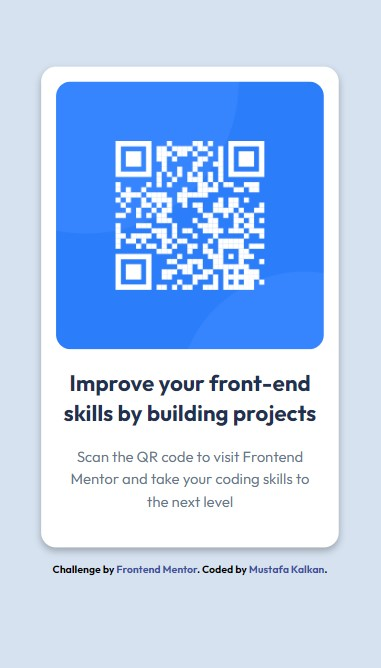

# Qr code component projects

This project is a qr code component web project page. The project was developed using HTML and CSS and published using GitHub.

Frontend Mentor - Qr code component
This is a solution to the Qr code component challenge in Frontend Mentor. Frontend Mentor challenges help you improve your coding skills by creating realistic projects.

Contents

- [Project URL](#project-urls)
- [Features](#features)
- [Project Content](#project-content)
- [How to Run](#how-to-run)
- [Screenshot](#screenshot)
- [Challenge](#challenge)
- [Technologies Used](#technologies-used)
- [Installation](#installation)
- [Author](#author)
- [License](#license)
- [Show-Your-Support](#show-your-support)

# Project URL

The project is published at: [Qr code component](https://mkalkandev.github.io/Qr-code-component/)

# Features

- **Responsive Design:** Provides a good user experience on all devices.

- **Simple and User Friendly Interface:** Provides easy access to recipe information.

- **Modern HTML and CSS Techniques:** Clean and maintainable code structure.

# Project Content

This project contains the following files and folders:

- **index.html:** HTML file of the home page.

- **style.css:** CSS file that creates the design of the project.

- **images/**: Folder containing the images used in the page.

# How to Run?

1. **Download Project File:**
Copy this project to your computer or download it as a ZIP.

```bash
git clone https://mkalkandev.github.io/Qr-code-component/.git
```

2. **Open HTML File:**
You can view the `index.html` file in the project directory by opening it in any browser.

3. **Access via GitHub Pages:**

You can access the project directly from [Qr code component]https://mkalkandev.github.io/Qr-code-component/)

# Screenshot



# Challenge

My app allows users to:

Display the optimal layout for the app based on their device's screen size
See the navigation states for all interactive elements on the page
Ongoing development
This was my second project involving HTML and CSS and I am happy with the result. This time I tried to learn new things so I tried to structure HTML better my first foray into semantic tags and it was the first project where I used flex and pseudo-classes in CSS. I also did a little introduction to Responsive design.

I plan to continue exploring this technology and learning more, so there will definitely be more projects related to it soon.

# Technologies Used

Operating System


Front fly

 

tools

 

# Setup

Follow these steps to set up the project: follow:

Clone the project repository using the following command:

git clone https://mkalkandev.github.io/Qr-code-component/
Go to the root of the project:

cd social-links-profile/
Install the project dependencies by running the following command:

# Author

👤 MustafaKalkan

Github:<a href="https://github.com/mkalkandev/" target="_blank">@mkalkandev</a>

Front-end Mentor:<a href="https://www.frontendmentor.io/profile/mkalkandev" target="_blank">@mkalkandev</a>

# License

📝 Copyright © 2024 MustafaKalkan.

This project is licensed under [MIT](./LICENSE).

# Show your support

If this project helped you, give it a ⭐️! Have fun building it! 🚀
